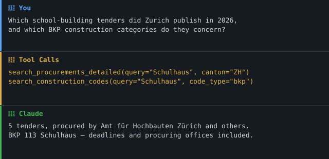

<!-- mcp-name: io.github.malkreide/swiss-procurement-mcp -->

> **Part of the [Swiss Public Data MCP Portfolio](https://github.com/malkreide/swiss-public-data-mcp)** — open-source MCP servers connecting AI agents to Swiss public and open data.
>
> This is a **private project**. It is independent of any employer or institutional affiliation and represents no official position of any authority.

# swiss-procurement-mcp

[](https://github.com/malkreide/swiss-procurement-mcp/actions/workflows/ci.yml)
[](https://pypi.org/project/swiss-procurement-mcp/)
[](https://pypi.org/project/swiss-procurement-mcp/)
[](LICENSE)
[](https://modelcontextprotocol.io/)
[](https://github.com/malkreide/swiss-public-data-mcp)
[](README.de.md)

MCP server for **Swiss public procurement** — read access to the official simap.ch API, covering all cantons and the Confederation, updated intraday.

---

## 🎯 Anchor demo query

> *«Which school-building tenders did the City of Zurich publish in 2026, which BKP construction categories do they concern, and who are the procuring offices?»*

A single `search_procurements_detailed(query="Schulhaus", canton="ZH", published_from="2026-01-01")`
returns the leading tenders already expanded with their BKP construction codes and
procuring offices — connecting procurement to school-building planning in one call
(optionally paired with `search_construction_codes` to resolve a category).

### Demo



---

## Why this server exists

Swiss public procurement is published on simap.ch. The platform's web UI is
searchable by hand, but the [`amtsblatt-mcp`](https://github.com/malkreide/amtsblatt-mcp)
server only reaches the three cantons (AR, BS, TI) that still mirror tenders to
the Amtsblattportal — Zurich among the missing.

simap closes that gap: it operates a documented **OpenAPI 3 read API (v1.5.1)**
whose search and detail endpoints are marked `security: None` and are callable
**without authentication**. This server wraps exactly those read endpoints.

> **Mnemonic:** *The web UI is the front door; the API is the loading dock. Probe the dock.*

---

## Architecture decision

**Architecture A (live API only, short-lived cache).**

- The public search, detail and reference endpoints are unauthenticated and were
  confirmed working live (2026-07-26).
- Publications change intraday, so the cache TTL is deliberately short (30 min).
- The ~200 write / `my/` / OIDC-protected endpoints (publishing tenders,
  submitting offers) are **out of scope** — this server never writes.

Every response carries `source` and `provenance` (`live_api` / `cached` /
`degraded`). Upstream failure yields a `degraded` envelope, never a silent empty
list.

---

## Live-probe findings (2026-07-26)

| Endpoint | Auth | Result |
|---|---|---|
| `/publications/v2/project/project-search` | none | 20 hits, canton filter, current-day |
| `/publications/v1/.../publication-details/...` | none | full record: criteria, deadlines, codes |
| `/publications/v1/publication/{id}/past-publications` | none | project lifecycle |
| `/codes/v1/cpv/search` | none | CPV full-text search |
| `/codes/v1/{bkp,npk,ebkp-h,ebkp-t,oag,cpc}/search` | none | Swiss construction codes |
| `/procoffices/v1/po/public` | none | ~1 MB office list (client-side filter) |
| `/cantons/v1`, `/countries/v1` | none | reference data |

### Known findings

1. **Wrong host, wrong conclusion.** The read API lives under `www.simap.ch/api`.
   The `simap.ch/de` web UI is a separate SSR app that exposes none of it —
   probing the UI produced an earlier, mistaken "no API" verdict.
2. **`lang` is mandatory** on project-search. Omitting it is HTTP 400
   (errorCode `E0025`), not an empty result. The client injects a default.
3. **Award is not "award".** `newestPubTypes=award` returns HTTP 400. Awards are
   split by procedure: `award_tender`, `award_study_contract`,
   `award_competition`, `direct_award`. The `search_awards` tool queries all four.
4. **Canton ids are bare.** `ZH`, not `CH-ZH`. Passing an ISO subdivision code
   silently matches nothing; this server rejects it with a clear error.
5. **A session cookie is required.** The first request sets it; a persistent
   HTTP client handles this transparently.

---

## Tools

| Tool | Purpose |
|---|---|
| `search_procurements` | Search projects by canton, CPV, process type, date, text |
| `search_procurements_detailed` | Search + full detail for the top *n* hits in one call (aggregated) |
| `search_awards` | Awarded contracts only (all four award types at once) |
| `get_procurement_details` | Full record for one publication |
| `get_publication_history` | Earlier publications of the same project (tender → award) |
| `search_cpv_codes` | Resolve keywords to CPV classification codes |
| `search_construction_codes` | Swiss construction codes (BKP, NPK, eBKP, OAG, CPC) |
| `find_procurement_office` | Public procurement offices by partial name |
| `source_status` | Reachability and latency of the simap.ch API |

All tools carry `readOnlyHint`, `idempotentHint` and `openWorldHint` (they query
the live simap.ch API).

Every tool takes a single validated argument object. Bounds, allow-lists and
patterns are declared on the input models in
[`inputs.py`](src/swiss_procurement_mcp/inputs.py) — so an out-of-range limit or
an unknown canton is rejected before any upstream request, and the constraints
are visible to the model in the tool schema rather than buried in the tool body:

```python
search_procurements({"canton": "ZH", "query": "Schulhaus", "limit": 20})
```

The models set `strict=True` (no silent `"10"` → `10` coercion) and
`extra="forbid"` (unknown fields are rejected, not ignored). The canton, process
type, publication type, code system and language allow-lists are derived from
`constants.py`, so they cannot drift from the probe-verified tables.

### What `canton=` means

simap offers exactly one geographic filter, `orderAddressCantons`, and it selects
by **where the work is delivered** — not by who is procuring. When a procuring
office files a free-text address, the structured canton is `null` and the
publication is invisible to that filter. Measured CH-wide over 500 projects
published since 2026-07-01: **303 (60.6%) carry no canton**, among them the Amt
für Hochbauten Zürich, Grün Stadt Zürich, USZ, BBL and SBB.

`canton_match` therefore makes the question explicit:

| Value | Matches | Zurich, 2026-07-01…27 |
|---|---|---|
| `procuring_body` *(default)* | procured by that canton's public bodies, incl. communal and subordinate offices (`issuedByOrganizations`) | **410** projects |
| `place_of_delivery` | the work is delivered there (`orderAddressCantons`) | 263 projects |
| `both` | union of the two; two upstream calls, no pagination | 441 projects |

The 31 projects only `place_of_delivery` finds are federal bodies procuring in
Zurich (ETH, Empa, Flughafen Zürich AG) — a different question, not a gap, which
is why this is three explicit semantics rather than a silent union.

Every response states in `note` which semantics were applied.

---

## Portfolio connections

- A vendor's UID links to [`register-mcp`](https://github.com/malkreide/register-mcp).
- BKP / eBKP construction codes on a tender connect procurement to school-building
  planning and to [`zh-education-mcp`](https://github.com/malkreide/zh-education-mcp).
- Complements [`amtsblatt-mcp`](https://github.com/malkreide/amtsblatt-mcp) with
  national coverage instead of three cantons.

---

## Installation

```bash
uvx swiss-procurement-mcp
```

### Claude Desktop

```json
{
  "mcpServers": {
    "swiss-procurement": {
      "command": "uvx",
      "args": ["swiss-procurement-mcp"]
    }
  }
}
```

### Cloud (Render / Railway)

```bash
MCP_TRANSPORT=sse HOST=0.0.0.0 PORT=8000 python -m swiss_procurement_mcp
```

### Container

```bash
docker compose up --build        # SSE on :8000
```

The image is multi-stage and runs as a non-root system user. `compose.yaml`
adds a read-only root filesystem, drops all capabilities, sets
`no-new-privileges`, and caps memory, CPU and PIDs. No secret is needed at
runtime — the wrapped simap.ch endpoints are public.

CI builds the image on every push and asserts both properties that matter:
that the container does not run as uid 0, and that the server still imports
under `--read-only --cap-drop ALL`.

### Configuration

| Variable | Default | Purpose |
|---|---|---|
| `MCP_TRANSPORT` | `stdio` | `stdio` \| `sse` \| `streamable-http` |
| `MCP_HOST` / `HOST` | `127.0.0.1` | HTTP binding (cloud transports only). Defaults to loopback; set `0.0.0.0` explicitly to expose all interfaces in a cloud deployment. |
| `MCP_CORS_ORIGINS` | _(unset)_ | Comma-separated origins allowed to call the HTTP transports from a browser. Unset means no cross-origin browser access at all — stdio and non-browser clients are unaffected. `Mcp-Session-Id` is exposed and accepted for the listed origins, so a browser client can hold a session. `*` is honoured but logs a warning and disables credentials, because browsers reject a wildcard origin together with credentials. |
| `MCP_STATELESS` | _(off)_ | Set to `1` to run the streamable-http transport with no session tracking. Removes session affinity as a concern for multi-instance deployments; gives up SSE stream resumption and server-initiated notifications. No effect on the legacy SSE transport, which logs a warning if asked. See [docs/load-balancing.md](docs/load-balancing.md). |
| `PORT` / `MCP_PORT` | `8000` | HTTP port (cloud transports only) |
| `LOG_LEVEL` | `INFO` | `DEBUG` \| `INFO` \| `WARNING` \| `ERROR`. Structured JSON, one object per line, always on **stderr** — stdout carries the MCP protocol on a stdio transport. |

No API keys — the wrapped simap.ch read endpoints are fully public.

Built on [structlog](https://www.structlog.org/). Every event emitted during a
tool call carries that call's `correlation_id`, bound via `contextvars` — so a
failure logged deep inside the HTTP client can be joined to the request that
caused it without threading context through every function.

| Level | Emitted when |
|---|---|
| `DEBUG` | a tool call was entered (`tool_call_started`) — tells you whether a hung call ever started |
| `INFO` | a tool call finished cleanly, with latency |
| `WARNING` | simap.ch was unreachable or errored (`upstream_degraded`) |
| `ERROR` | a tool call raised |

Records carry the exception *type* only — never its message and never an
upstream response body (OBS-002).

```json
{"event":"tool_call_started","tool":"search_procurements","correlation_id":"23221af26ae640c7","level":"debug","timestamp":"2026-07-27T22:20:07.494276Z"}
{"status":"ok","latency_ms":312,"event":"tool_call","tool":"search_procurements","correlation_id":"23221af26ae640c7","level":"info","timestamp":"2026-07-27T22:20:07.806Z"}
```

---

## MCP Protocol Version

| | |
|---|---|
| **Served via the `initialize` handshake** | `2024-11-05` … **`2025-11-25`** — the handshake ceiling |
| **Served via the per-request envelope** | **`2026-07-28`** |
| **Who picks** | The client's first request, once per connection. A request carrying the `2026-07-28` `_meta` envelope opens a modern connection; anything else opens a handshake connection. |
| **Pinned in** | `MCP_PROTOCOL_VERSION` in [`server.py`](src/swiss_procurement_mcp/server.py) |
| **SDK** | `mcp>=2.0.0,<3` |
| **Cache hints** | `tools/list` and `server/discover`: `ttlMs` 300000, `cacheScope` `public` |

The MCP Python SDK negotiates the protocol version in the session layer and
offers no constructor parameter for it, so the version cannot be pinned by
configuration. It is pinned as a declared constant and enforced by detection:

- **At runtime**, a mismatch between the constant and the SDK logs a
  `protocol_version_drift` event at `WARNING`. The server keeps working.
- **In CI**, `tests/test_protocol_version.py` fails.

That split is deliberate. An SDK bump should break *our* build, not the runtime
of someone who upgraded `mcp` in their own environment.

### Update policy

- Dependabot opens SDK update PRs monthly (`.github/dependabot.yml`).
- When an SDK update moves the protocol version, the CI test fails. The fix is
  **not** to edit the constant blindly: read the spec changelog for what changed
  between the two versions, verify the server still behaves, then bump the
  constant, this section and `CHANGELOG.md` in one commit.
- Protocol-version bumps are called out explicitly in `CHANGELOG.md`, not folded
  into a dependency-bump line.

---

## Primitives: tools only

This server exposes **tools** and neither resources nor prompts. That is a
decision, not an omission, so here is the reasoning (ARCH-008).

**Why not resources.** Resources address *identifiable, listable* content —
`GET`-like reads the client can enumerate and cache. simap's endpoints are the
opposite: every useful call is a query with filters over a corpus of ~200k
publications that changes intraday. A resource URI would either enumerate
something unbounded or encode a full query in the URI, which is a tool with
extra steps.

Two tools were checked concretely for migration potential and rejected for
specific reasons, not by blanket policy:

| Candidate | Why it stays a tool |
|---|---|
| `source_status` | Genuinely resource-shaped — one fixed, cacheable document. But it exists to be *called* when a result looks wrong, and a resource the model has to remember to re-read is worse at that job than a tool it can invoke on suspicion. |
| `search_cpv_codes` | The CPV catalogue is finite and stable enough to enumerate. But it is ~10k entries; exposing it as a resource would push the whole classification into the context window, when the point of the tool is that the *server* does the lookup. |

**Why not prompts.** A curated prompt list would encode question templates
("which tenders in canton X…"). The tool docstrings already carry that guidance
where the model actually reads it, and prompts would duplicate it in a second
place that can drift — this repo has already been bitten twice by exactly that
class of duplication.

This will be revisited if the server ever gains a genuinely enumerable,
slow-changing dataset.

---

## Testing

```bash
PYTHONPATH=src pytest tests/ -m "not live"   # offline, respx-mocked
PYTHONPATH=src pytest tests/ -m live         # hits the real API
```

See [EXAMPLES.md](EXAMPLES.md) for use cases grouped by audience (schools,
public, administration, developers) and a tool-selection reference table.

---

## Known limitations

- **Projects, not publications.** `project-search` indexes projects and
  represents each by its *newest* publication. A project tendered in March and
  awarded in July appears once, as the July award; `search_awards` likewise only
  finds projects whose newest publication is an award, so a later correction
  hides it. `get_publication_history` reaches the earlier publications.
- **At least one filter is required.** simap answers a filterless query with
  nothing rather than everything, so the tools refuse it with that reason
  instead of reporting an empty result.
- **Read-only by design.** Publishing and submission endpoints exist in the
  simap API but are deliberately not wrapped.
- **Award coverage is uneven** across cantons; some publish awards diligently,
  others rarely. Absence of an award is not proof none happened.
- **No contract values in search results.** Amounts, where published, live in the
  detail record's statistics section, which varies by procedure.
- **Unofficial client.** Publications remain authoritative on simap.ch itself.

---

## Project structure

```
swiss-procurement-mcp/
├── src/swiss_procurement_mcp/
│   ├── server.py      # MCPServer tools (9, read-only)
│   ├── client.py      # simap.ch HTTP client + retry + normalisation
│   ├── constants.py   # probe-derived lookup tables (cantons, pub types, codes)
│   ├── models.py      # Pydantic v2 envelopes (source + provenance)
│   ├── inputs.py      # strict Pydantic tool-input models (bounds, allow-lists)
│   ├── _fuzzy.py      # term widening for the taxonomy lookups (ARCH-003)
│   ├── _log.py        # structured JSON logging to stderr + @logged_tool
│   ├── _net.py        # DNS-pinned transport (egress allow-list)
│   ├── _cors.py       # CORS layer for the HTTP transports
│   └── __main__.py    # Dual-transport entry point (stdio / SSE / streamable-http)
├── tests/             # respx-mocked + @pytest.mark.live
└── .github/workflows/ # CI + OIDC PyPI/MCP-registry publish
```

### Why there is no `tools/` package

The portfolio structure standard asks for a `tools/` package once a server
exposes more than five tools. This one exposes nine and keeps them in
`server.py`, which is a deliberate deviation rather than an oversight — recorded
here because this is where the standard, and anyone comparing against it, looks.

`server.py` is ~900 lines and the surrounding modules above are already split out
by concern, so the intent of the standard — a codebase navigable without
scrolling one omnibus file — is met. What the split would add is the literal file
layout.

The companion server `amtsblatt-mcp` is the case where it was worth doing: its
`server.py` had grown to 2477 lines holding HTTP plumbing, XML parsing, a
taxonomy cache, the input models and every handler, and it was split in that
project's 0.21.0. That refactor is also the reason for caution here — it
introduced a defect (an extracted module captured a cache global by value, so a
tool silently reported stale state) that the **entire test suite passed
through**, because no test covered the affected path. It was caught by reading
the diff.

Moving nine handlers for the literal form of a standard whose intent is already
satisfied would take that risk for no navigational gain. This should be revisited
if `server.py` passes roughly 1500 lines.

---

## Maturity & updates

**Phase 1 — read-only** (see [ROADMAP.md](ROADMAP.md) for the phase-specific
backlog and what a phase transition would require). This server wraps only the
public read endpoints; the
write / OIDC-protected simap endpoints are deliberately out of scope. See the
[SECURITY.md](SECURITY.md) re-evaluation triggers for the conditions that would
move it to a write phase.

The server targets the MCP spec version pinned as `MCP_PROTOCOL_VERSION` — see
[MCP Protocol Version](#mcp-protocol-version) above for the current value and
how the pin is enforced. SDK and dependency updates arrive as
[Dependabot](.github/dependabot.yml) PRs, so a breaking protocol or SDK change
is reviewed deliberately rather than drifting in silently.

## Contributing

Contributions are welcome — see [CONTRIBUTING.md](CONTRIBUTING.md) for how to
report bugs, suggest a new endpoint, or submit code.

## Security

This is a read-only, no-PII, public-open-data server. Audited against the
portfolio MCP best-practice catalogue (**15 pass / 16 partial / 1 fail** across
32 applicable checks, production-ready). See [SECURITY.md](SECURITY.md) for the
posture and how to report a vulnerability, and [`audits/`](audits/) for the full
report.

## License

MIT License — see [LICENSE](LICENSE). The tenders are official public-procurement
announcements; simap.ch publishes no explicit open-data licence, so reuse follows
the simap.ch terms (see Credits).

## Author

**Hayal Oezkan** · [github.com/malkreide](https://github.com/malkreide)

## Changelog

See [CHANGELOG.md](CHANGELOG.md).

---

## Credits

- Data: [simap.ch](https://www.simap.ch) read API v1.5.1, operated by the simap.ch association. API docs: [simap.ch/api-doc](https://www.simap.ch/api-doc) — machine-readable OpenAPI spec at [`/api/specifications/simap.yaml`](https://www.simap.ch/api/specifications/simap.yaml), which a live test checks the enum constants against. Guides: [kissimap.ch](https://www.kissimap.ch/de/anleitungen).
- The underlying tenders are official public-procurement announcements by Swiss public bodies. simap.ch publishes **no explicit open-data licence**; reuse is subject to the [simap.ch terms](https://www.simap.ch/de/about/legal). Attribute the source as *simap.ch (Verein simap.ch)*.
- Built following the `mcp-data-source-probe` methodology.

The **code** in this repository is MIT licensed; the **data** is simap.ch's, under its terms (see above). Public money, public code.
